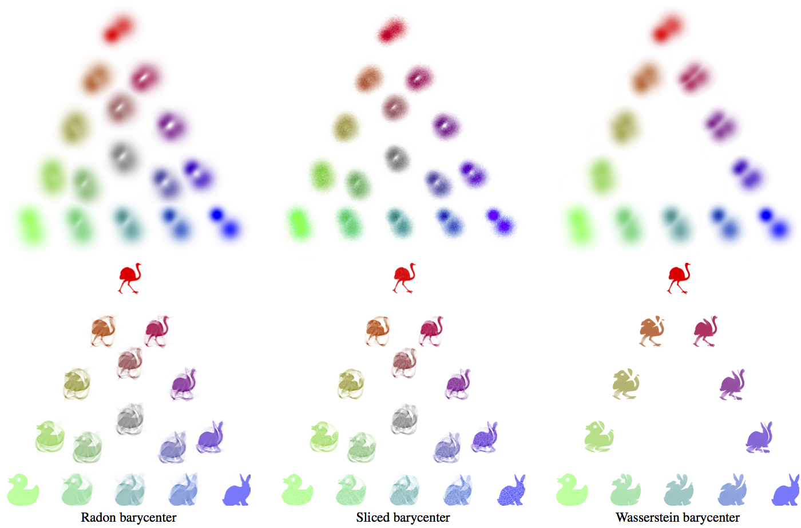

This toolbox contains the code code to reproduce the result of the article:

N. Bonneel, J. Rabin, G. Peyré, H. Pfister. [Sliced and Radon Wasserstein Barycenters of Measures](https://hal.archives-ouvertes.fr/hal-00881872/). Journal of Mathematical Imaging and Vision, 51(1), pp. 22–45, 2015.

* radon/ contains the code to compute the Radon Wasserstein barycenter.
* sliced/ contains the code to compute the Sliced Wasserstein barycenter.
* fast-slant-stack/ is a library required by the Radon Wasserstein barycenter code.

Copyright (c) 2013 Nicolas Bonneel, Julien Rabin, Gabriel Peyre and Hanspeter Pfister
